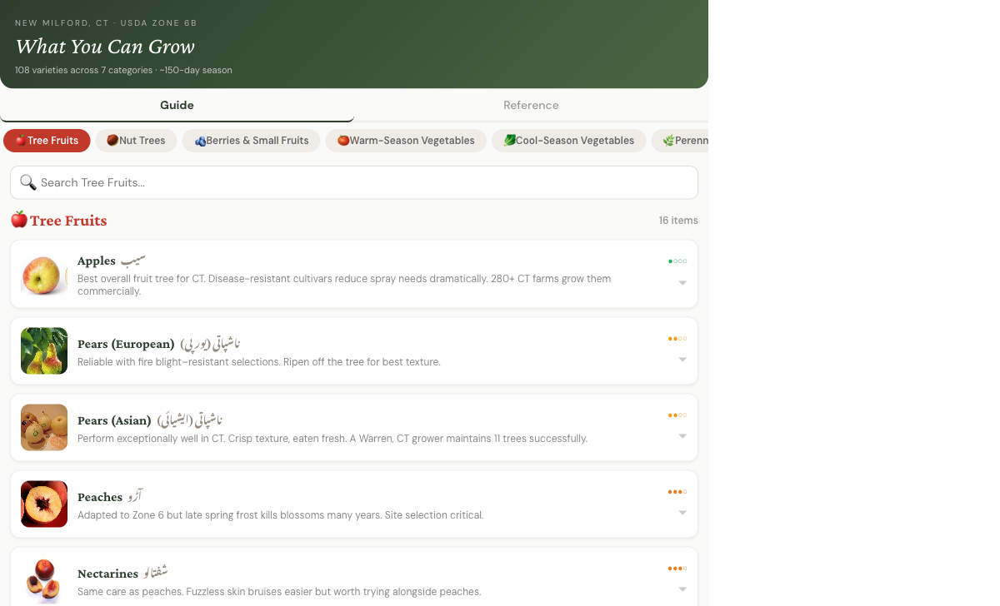

# New Milford Grow Guide

An interactive, bilingual (English/Urdu) gardening reference for New Milford, CT (USDA Zone 6b). Browse 108 varieties across 7 categories with local photos, difficulty ratings, and quick reference guides.



## Features

- **Tabbed mobile-first UI** — swipe between categories, tap to expand details
- **Bilingual** — full Urdu translations for every item
- **Search** — filter items within each category
- **Quick Reference** — key dates, soil info, pest solutions, CT resources
- **Print layout** — `Ctrl+P` renders a clean, full single-page printable guide
- **Offline images** — all 110 plant photos bundled locally

## Tech Stack

- **React** (single-component SPA)
- **Vite** (build + dev server)
- **GitHub Pages** (static hosting via GitHub Actions)
- **Wikipedia Commons** (image source, downloaded locally)

## Local Development

```bash
cd grow-guide
npm install
npm run dev
```

Open `http://localhost:5173` in your browser.

## Build

```bash
npm run build
npm run preview
```

## Deployment

Pushes to `master` automatically deploy to GitHub Pages via `.github/workflows/deploy.yml`.

**Live site:** [https://mumarj.github.io/new-milford-garden/](https://mumarj.github.io/new-milford-garden/)
